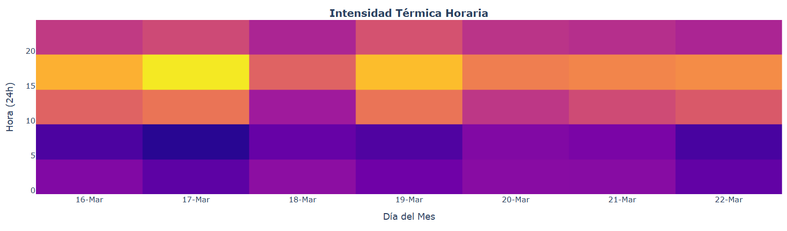
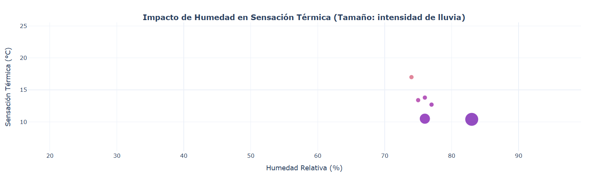
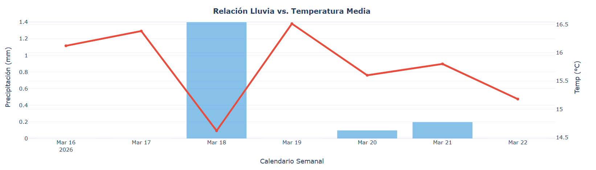

<h1 align="center">ANÁLISIS Y CUADROS DE MANDO</h1>


> **Profesor:** Alberto Márquez Alarcón - [@amarala931](https://github.com/amarala931).

## 👥 Miembros del Equipo

- Andrés Prado Morgaz - [@andpramor](https://github.com/andpramor).
- Manuel Jesús de la Rosa Cosano - [@Nastupiste](https://github.com/Nastupiste).

---

## 3.1. Representación y Estructura de Datos

### 👣 Pasos

- [x] **Paso 0**. Prerrequisitos: Base de datos.
  - [x] Adaptar el ejercicio a sqlite3 (la MongoDB de la actividad 1.7. ya se ha borrado de la capa gratuita de MongoAtlas).
  - [x] Poblar la nueva Base de Datos.
  - [x] Documentar en este README cómo instalar las dependencias de este proyecto.

- [x] **Paso 1**. Conexión.
  - [x] Establecer la conexión entre el entorno de Python y la base de datos.
  - [x] Extraer datos y cargarlos en un objeto de Polars (utilizando el método de Polars: read_database).

- [x] **Paso 2**. Limpieza y Estructuración con Polars.
  - [x] Tratamiento de valores nulos o inconsistentes.
  - [x] Creación de columnas calculadas: hemos creado columnas para temperatura máxima, mínima y mediana.
  - [x] Agrupaciones (GroupBy) para segmentar la información: lo hemos hecho por ID en df_stats.
        DUDA: Agrupaciones ¿Añadimos por años?
        DUDA: ¿Los datos se duplican al correr varias veces la extracción en menos de 12 horas (la API nos da el hourly de 12 horas)? En main.py hay una línea comentada para hacer una extracción nueva.

- [x] **Paso 3**. Generación de Dataframes para Informes.
  - [x] Exportar archivos CSV con el contenido de cada dataframe.
        Modificar exportación para añadir datos a los existentes en los casos acumulativos (current no, el resto sí).

- [x] **Paso 4**. Análisis visual con Plotly.
  - [x] Gráficos de líneas interactivos para ver la evolución temporal.
  - [x] Scatter plots (diagramas de dispersión) para ver la correlación entre dos variables.
  - [x] Gráficos facetados (subplots) para comparar distintas regiones o indicadores simultáneamente.

- [x] **Paso 5**. Documentación y Sincronización.
  - [x] Actualizar el repositorio de GitHub, incluyendo el requirements.txt.
  - [x] Documentar en este README.md las visualizaciones generadas y conclusiones preliminares obtenidas.

---

### Visualizaciones generadas

Hemos generado las siguientes visualizaciones:

#### Intensidad térmica horaria



#### Impacto de la humedad en la sensación térmica



#### Relación lluvia - temperatura media



**Conclusiones**

- Correlación inversa entre temperatura y humedad: cuando la temperatura alcanza sus picos máximos, la humedad relativa cae a sus niveles más bajos, y viceversa.

- Los días de lluvia, la temperatura cae.

### ENTREGA 3.1.

- Scripts de python: `main.py`, carpeta scripts_3_1 y carpeta scripts_1_7_weather_apis de este repositorio, que incluye el código de la actividad 1.7 del que partimos, muy modificado para esta actividad.
- Carpeta data_output/ con los csv generados: incluida en este repositorio.
- Exportaciones de los gráficos: docs/plots.html en este repositorio, desplegado en [esta dirección](https://nastupiste.github.io/IABD-SBD-Representacion-y-Estructuracion-de-Datos/).
- Breve informe final: el punto anterior de este README (Visualizaciones generadas).

---

## 3.3. Modelado y algoritmos

### 👣 Pasos

1. Preparación del Dataset y Feature Engineering
2. Criterio de Elección de Algoritmos
3. Interpretación de Métricas y Resultados
4. Valor Aportado al Problema

### ENTREGA 3.3.

- Scripts de python: `main_3_3.py`, carpeta scripts_3_3 de este repositorio.
- Informe.

---

## 🔢 Instalación de dependencias

### Utilizando `uv`

Tras clonar el repositorio en local, abrimos una terminal en la raíz del proyecto y ejecutamos:

```bash
uv sync
```

Esto genera un entorno virtual en la raíz del proyecto e instala las dependencias listadas en `pyproject.toml`.

### Utilizando `pip`

Generamos un entorno virtual (`python -m venv <nombre_del_entorno>`), lo activamos con `.\<nombre_del_entorno>\Scripts\activate` (Windows) o `source <nombre_del_entorno>/bin/activate` (MacOS o Linux).

Hecho esto, ejecutamos:

```bash
pip install -r requirements.txt
```

> NOTA: Hemos utilizado `uv`, por lo que hemos generado el archivo `requirements.txt` de este proyecto ejecutando:

```bash
uv export --format requirements-txt --no-hashes --no-annotate --no-header --output-file requirements.txt
```

---

## 💻 Ejecución del proyecto

Con las dependencias instaladas y el entorno virtual activado, ejecutamos el archivo `main.py`:

```bash
python main.py
```
